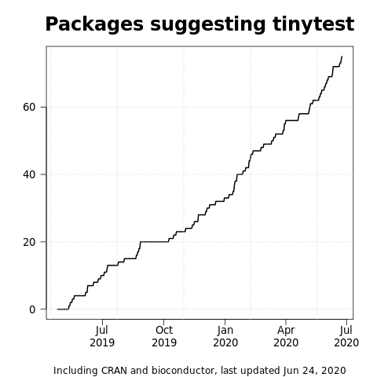

[](http://cran.r-project.org/package=tinytest/)
[](https://CRAN.R-project.org/package=tinytest)
[](http://cran.r-project.org/package=tinytest/)


# tinytest
A lightweight, no-dependency, full-featured package for unit testing

[Overview of functionality](pkg/README.md)


## Installing tinytest

### From CRAN

In `R`, do
```r
install.packages("tinytest")
```

### From GitHub

In your (bash) shell, do

```bash
git clone https://github.com/markvanderloo/tinytest
cd tinytest
make install
```



## tinytest philosophy.

### Testing should be as easy as possible. 

Testing infrastructure must not get in the way of the developer. Setting up
tests should be done with ease. In `tinytest` tests are simple R-scripts
where test statements can be interspersed with other code (e.g. to prepare
some results for testing).


### Test results are data


The purpose of testing is to  gather evidence (data) that builds confidence in
the quality of software. Unit tests consist of expressions where an expected
result is compared with the result of a program or function. For example:

```r
addOne <- function(x) x + 1
subOne <- function(x) x - 2

# this test should pass
tinytest::expect_equal(addOne(1), 2 )

# this test will fail
tinytest::expect_equal(subOne(2), 1 ) 
```

Some unit testing frameworks for R throw a formal exception (error) whenever a
test fails. There are several reasons why this is not a good idea.

1. You do not need to throw an error to discover that a test has failed. A boolean
result is in principle enough.
2. A [traceback](https://www.rdocumentation.org/packages/base/versions/3.5.2/topics/traceback)
of the error does not give you any information on the cause of the test
failure. This is because the test function throws the error, not the tested
code.
3. Throwing errors complicates the code needed for developing a testing suite,
making testing suites harder to maintain and possibly more complex to use than
necessary.

`tinytest` therefore treats test results as data, not as exceptions. This data
can be summarized and investigated by any method you already know in R.

### Error on deploy

There is a case where the failure of a test should cause an error, namely when
testing for deployment (e.g. publishing a package on CRAN). Therefore, when
running `R CMD check`, an error will be thrown if a test has failed. This way
the error interrupts the _deployment_ process instead of the _testing_ process.


### Run all tests

By default all tests are run and the results are summarized to one line of
output per failed test.

### Tests are installed with the package

So a package author can request test results from users that installed the package.


### Show you what you need

Developing and debugging takes focus and often deep concentration. `tinytest`
supports your workflow by directing you as quickly as possible
to the source of the test failure. In a single line of output you get the
test result, the file and location in the file, and the test call that failed.
Of course, printing is configurable through options.

### Light weight is the right weight

Keep it simple, keep it clean. See  [tinyverse.org](http://www.tinyverse.org).


